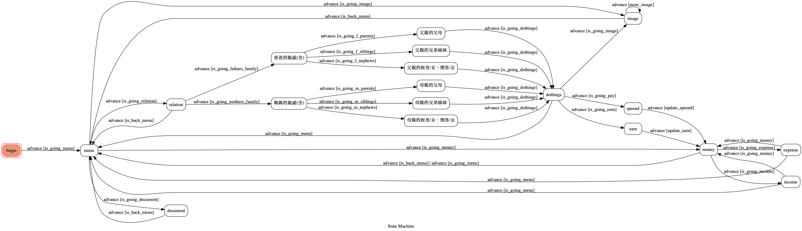

# TOC Project 2021
> A Line bot based on a finite state machine

## 構想
隨著過年的時間逐步接近，我便決定撰寫這個 Line Bot 工具，透過下列一些簡單的功能，
解決我在過年時的困擾。

這個  Line Bot 具備了以下的實用功能：
- 簡單的親戚稱謂查詢
    - 可以在我忘記某親戚的稱謂又想拿紅包時，用來查詢其稱謂
    - 由於華人的稱謂系統相當複雜，這個功能是以我會需要查詢的部分進行實作，像是配偶家人的稱謂還有待之後實作。
- 紅包金額紀錄
    - 可以紀錄紅包的「收入」或 「支出」，紀錄包含金額以及對應到的親戚稱謂。
    - 可以省去忘記紅包收入金額時重新算錢的麻煩。
    -  也可以確實掌握紅包包了多少錢給別人。
- 產生賀年貼圖
    - 這個功能可以自動隨機爬取賀年的長輩圖（每批次三張）
    - 一但產生出喜歡的圖片就可以直接轉傳，相當方便。
    - 可以讓長輩覺得你很孝順，增進家人間的感情。

## 實作細項
1. 部署到 Heroku
2. 多使用者獨立的 FSM
3. 獨立存取每個使用者的資料，以 json 檔案實作
4. 網路圖片抓取
5. 運用不同種的 Line 回應格式（image, template, text...）
6. ...

## FSM graph

## Line Bot QR code

## 示範截圖

### 親戚稱謂查詢 & 紅包收發

<!--  -->

<!--  -->

<!--  -->

<!--  -->

<!--  -->

<!--  -->

### 紅包管理

<!--  -->

<!--  -->

### 賀年貼圖

<!--  -->

<!--  -->

### Document

<!--  -->

## Reference
[Line Bot Python SDK](https://github.com/line/line-bot-sdk-python)

[親戚稱呼計算機/三姑六婆網頁版](https://www.ifreesite.com/kinship/)